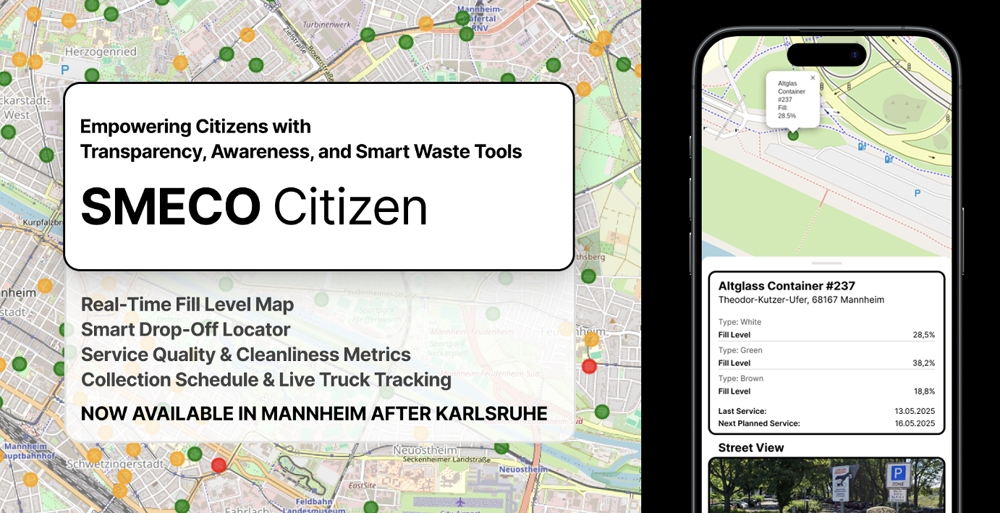

# SMECO
Smart Eco Systems - where ecology and economy converge to power intelligent, sustainable infrastructure for cities, citizens, and the planet.


# About SMECO
SMECO Systems are smart logistics and information systems for glass container collection. SMECO optimizes collection routes for glass container trucks using real-time fill-level data from sensors, ensuring efficient and sustainable operations. Additionally, the system offers a user-friendly app for citizens to check nearby container fill levels, helping them avoid overfilled sites and promoting responsible recycling behavior.



<h1 align="center">♻️ Container Occupancy Management Backend</h1>
<p align="center">
  <b>Smart, Sustainable, and Scalable Waste Collection</b><br>
  <i>Built with FastAPI & MySQL • Ready for Hackathons • Flutter-Ready API</i><br>
  <a href="https://hackxplore-backend.onrender.com/docs" target="_blank"><b>🌐 Live API Docs (Deployed Version) hackxplore-backend.onrender.com/docs</b></a>
</p>

---

## Github link
[http://github.com/HarunSMetin/hackxplore_backend](http://github.com/HarunSMetin/hackxplore_backend) 
## 🚀 Why This Project?

**Cities waste millions on inefficient trash collection.**  
Our backend powers a smarter, greener, and more cost-effective way to manage container pickups—using real-time data, route optimization, and CO₂ tracking.

- **Save fuel & reduce emissions**
- **Cut operational costs**
- **Integrate with any modern frontend (Flutter-ready!)**
- **Instant setup for hackathons & demos**

---

## 🛠️ Features

- ⚡ **Lightning-fast FastAPI backend**
- 🗺️ **Optimized route planning** for trucks & containers
- 📊 **CO₂ emission estimation** for every route
- 🔄 **Automatic CSV data import** (just drop your file in!)
- 🐳 **Dockerized** for instant deployment
- 🧩 **Modular, hackathon-friendly codebase**
- 📝 **OpenAPI/Swagger docs** for easy frontend integration

---

## 🗂️ Project Structure

```
main.py                # FastAPI entrypoint
routes/                # API endpoints
crud/                  # Database logic
schemas/               # Pydantic models
models/                # SQLAlchemy models
database/              # DB connection/session
services/              # Route & CO₂ logic
scripts/               # Data import tools
.env.example           # Sample environment config
run.sh                 # Quickstart script
```

---

## ⚡ Quickstart

1. **Clone & Configure**

   ```bash
   git clone https://github.com/your-repo/container-backend.git
   cd container-backend
   cp .env.example .env  # Edit with your MySQL credentials
   ```

2. **Install Dependencies**

   ```bash
   pip install -r requirements.txt
   ```

3. **Run Database Migrations**

   ```bash
   alembic upgrade head
   ```

4. **Start the Server**
   ```bash
   uvicorn main:app --reload
   ```

---

## 📥 Data Import

- **Automatic:** On first run, if the containers table is empty, the backend imports from `augmented_common_containers_with_types.csv` in the project root.
- **Manual:**
  - Windows: `import_containers.bat`
  - Linux/Mac: `./import_containers.sh` (run `chmod +x import_containers.sh` first)

**CSV Format:**

```
Name,Address,Latitude,Longitude,Date,Time,FillLevel_m3,Capacity_m3,Type
```

---

## 🐳 Docker & Compose

**Build & Run with Docker:**

```bash
docker build -t container-backend .
docker run --env-file .env -p 8000:8000 container-backend
```

**Recommended: Use Docker Compose for full stack (API + MySQL):**

```bash
docker-compose up --build
```

- FastAPI: [http://localhost:8000](http://localhost:8000)
- MySQL: Exposed on port 3307 (see `docker-compose.yml`)

---

## 📲 API & Frontend Integration

- **Swagger/OpenAPI Docs:** [http://localhost:8000/docs](http://localhost:8000/docs)
- **Export OpenAPI Spec for Flutter:**
  ```bash
  curl http://localhost:8000/openapi.json -o openapi.json
  ```

---

## 🌱 CO₂ Emission Estimation

- See `services/co2.py` for the logic.
- Every route plan includes emission metrics—helping cities go green!

---

## 🚦 Deployment & CI/CD

- **GitHub Actions** auto-builds and deploys on push to `main`.
- `run.sh` simulates deployment for hackathon demos.

---

## 🏆 Ready for Hackathons

- **Plug-and-play:** Works out of the box
- **No authentication:** Focus on features, not login screens
- **Flutter-ready:** Generate clients instantly from OpenAPI

---

## 📄 License

MIT License

---

<p align="center">
  <b>Let’s make waste collection smarter, greener, and hackathon-winning! 🚛🌍</b>
</p>
<h1 align="center"> HackXplore Smart Waste Dashboard FRONTEND</h1>

<p align="center">
  
  
  
  
</p>

<p align="center">
  <b>Real-time, interactive, and beautiful dashboard for smart waste management.</b><br>
  <i>Built in 24 hours for HackXplore 2025 🚀</i>
</p>

---

## 🚀 Live Demo

👉 **[Try it now! https://smecosystems.netlify.app](https://smecosystems.netlify.app/)**

---

## ✨ Features

- 🗺️ **Live Map:** Instantly see all waste containers and trucks.
- ⏳ **Time Travel:** Replay history with a single click.
- 📊 **Analytics:** Get instant stats on waste, fill levels, and service needs.
- 🚚 **Truck Management:** Add, edit, and monitor trucks and their capacities.
- ⚡ **Fast & Responsive:** React 19, MUI, and TypeScript.
- 🌙 **Dark Mode:** For late-night hacking and city ops.

---

## 🛠️ Quickstart

```bash
git clone https://github.com/HarunSMetin/hackxplore_frontend.git
cd hackxplore-frontend
npm install
npm start
```

Open [http://localhost:3000](http://localhost:3000) in your browser.

---

## 🏆 Why This Project?

- **Real-time everything:** See the city’s waste status live.
- **Time slider:** Instantly jump to any moment in the past.
- **Mobile-ready:** Works on any device.
- **Hackathon-built:** Fast, beautiful, and easy to extend.

---

## 📄 License

MIT

---

<p align="center">
  <b>Let’s make cities cleaner, smarter, and greener. Happy hacking! 🚀</b>
</p>
